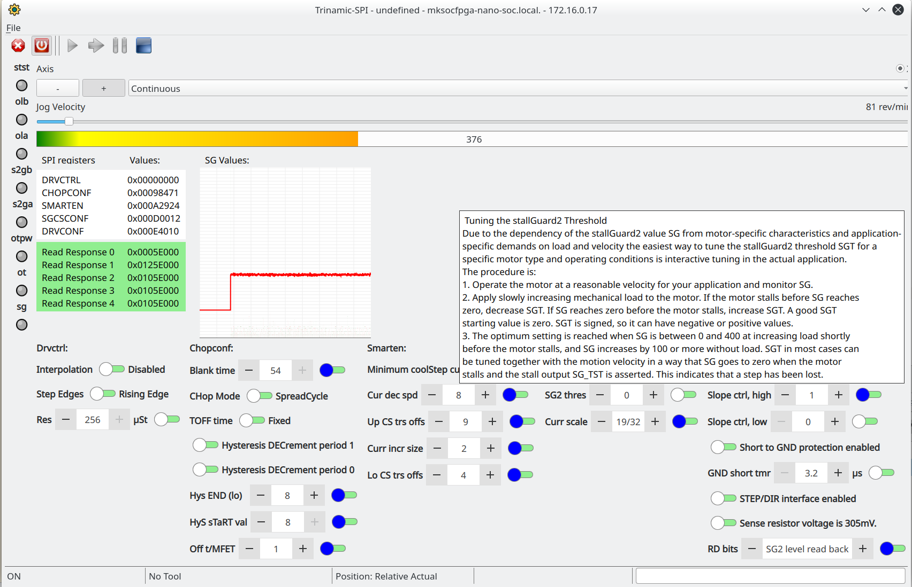

 Trinamic SPI configurer
 ========
 
 
 Mksocfpga enabled configs:
 https://github.com/machinekit/mksocfpga/blob/master/HW/hm2/config/DExx_Nano_xxx_Cramps/PIN_3x24_cap_enc_bspi.vhd
 or
 https://github.com/machinekit/mksocfpga/blob/master/HW/hm2/config/DExx_Nano_xxx_Cramps/PIN_3x24_cap_enc_dbspi.vhd
 
 
